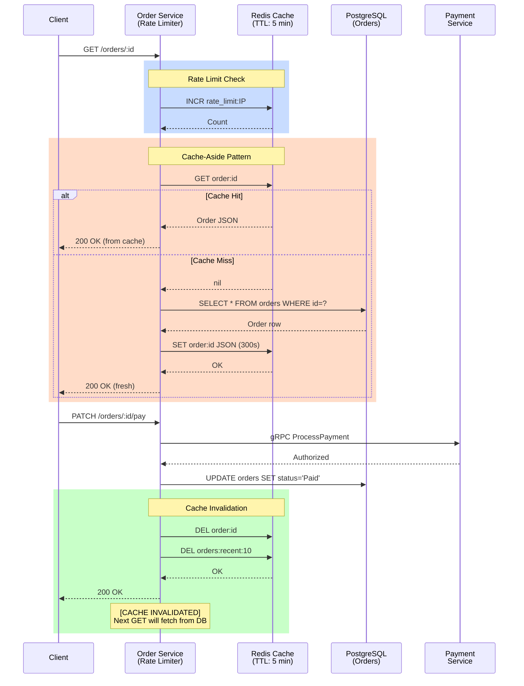
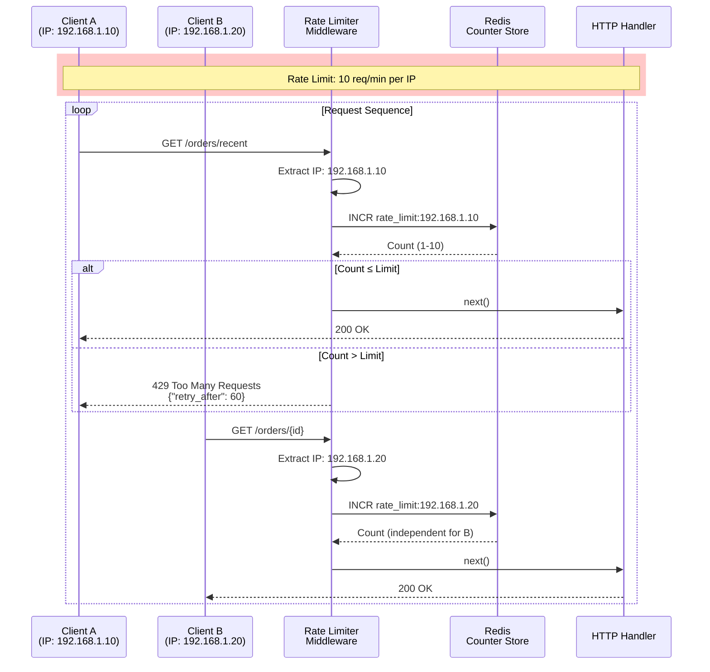
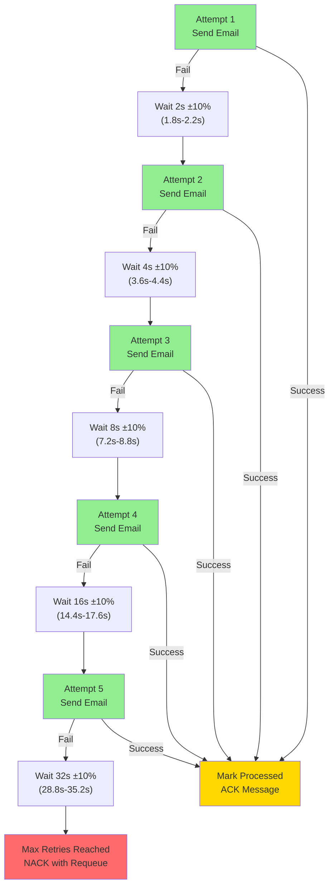
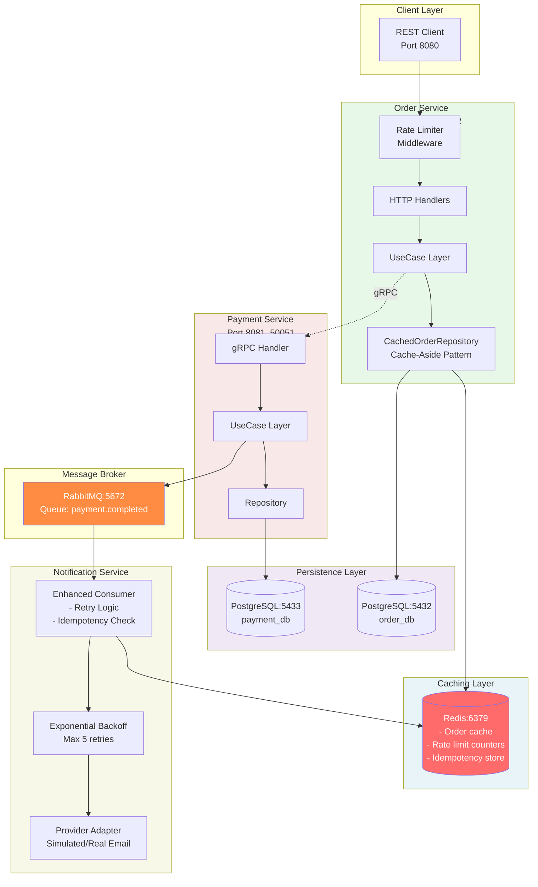
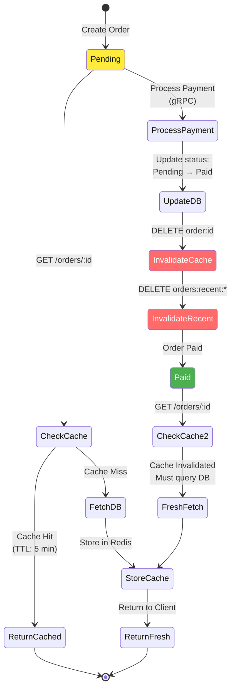

# Assignment 4 - Architecture Diagram (Mermaid)

## Cache-Aside Pattern Flow



## Background Job Processing with Retry Logic

```mermaid
sequenceDiagram
    participant RabbitMQ
    participant Consumer as Notification Service<br/>(Enhanced Consumer)
    participant Redis as Redis<br/>(Idempotency)
    participant Retry as Retry Logic<br/>(Exp. Backoff)
    participant Provider as Email Provider<br/>(Simulated/Real)

    RabbitMQ->>Consumer: Deliver payment.completed<br/>(PaymentEvent)
    
    rect rgb(255, 240, 200)
    Note over Consumer,Redis: Idempotency Check
    Consumer->>Redis: EXISTS idempotency:event_id
    alt Already Processed
        Redis-->>Consumer: 1 (exists)
        Consumer->>RabbitMQ: ACK (skip)
        Note over Consumer: [DUPLICATE] Skipped
    else First Time
        Redis-->>Consumer: 0 (not exists)
        Consumer->>Consumer: Parse event
    end
    end
    
    rect rgb(200, 220, 255)
    Note over Consumer,Provider: Retry Loop (Max 5 attempts)
    
    loop Max 5 Attempts
        Consumer->>Retry: ExecuteWithRetry(sendEmail)
        activate Retry
        
        alt Attempt Success
            Retry->>Provider: Send(to, subject, body)
            Note over Provider: [SIMULATED EMAIL]<br/>Latency: 500ms ±30%<br/>Failure rate: 10%
            Provider-->>Retry: nil (success)
            Retry-->>Consumer: success
            deactivate Retry
            break
        else Attempt Fails
            Retry->>Provider: Send(to, subject, body)
            Provider-->>Retry: error (simulated)
            Retry->>Retry: Calculate backoff<br/>2s → 4s → 8s → 16s → 32s
            Retry-->>Consumer: wait N seconds
            Note over Retry: Attempt {i} failed, retrying in {delay}
        end
    end
    end
    
    rect rgb(200, 255, 200)
    Note over Consumer,Redis: Mark Processed & ACK
    Consumer->>Redis: SET idempotency:event_id processed (24h TTL)
    Redis-->>Consumer: OK
    Consumer->>RabbitMQ: ACK
    Note over RabbitMQ: Message removed from queue
    end
```

## Rate Limiter Flow



## Exponential Backoff with Jitter



## Deployment Topology



## Invalidation Strategy



